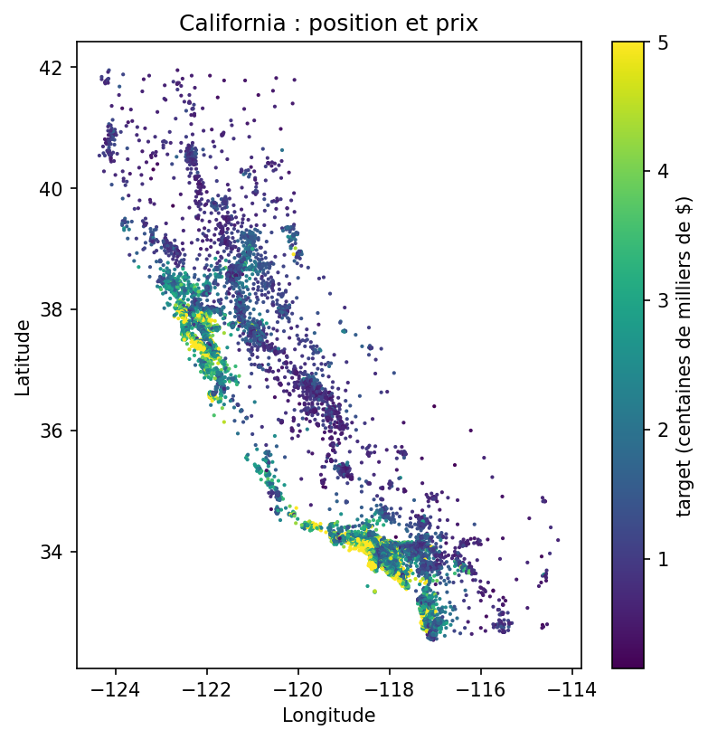
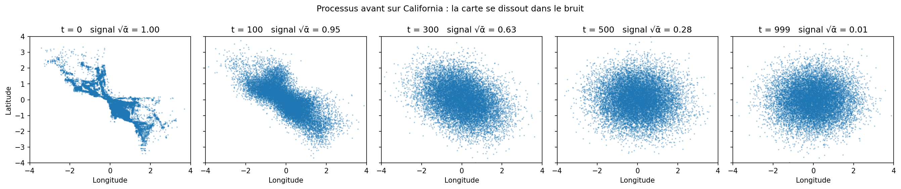
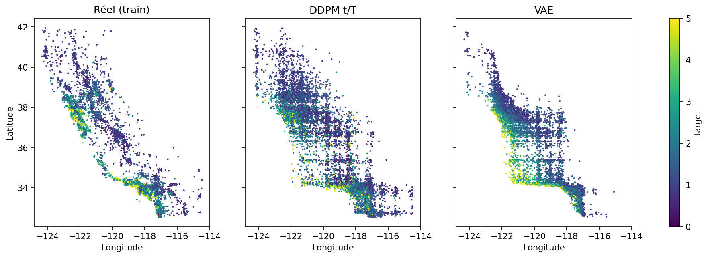
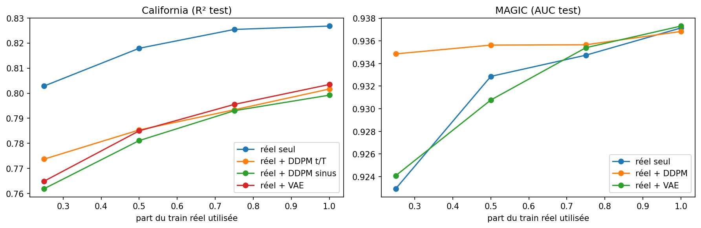
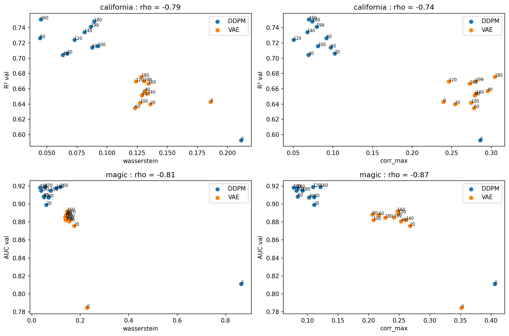

# Diffusion vs VAE sur des données tabulaires

Projet perso pour apprendre à coder un modèle de diffusion (DDPM, Ho et al. 2020) et voir ce qu'il vaut sur des tableaux de données.

La question de départ : si on entraîne un modèle sur des données générées au lieu de vraies données, on perd combien ? Et est-ce que les données qui ressemblent le plus aux vraies sont aussi celles qui servent le plus ?

Je compare deux générateurs :

- un DDPM codé à la main en PyTorch ;
- un VAE, plus classique, comme point de comparaison.

## Les données

Deux jeux sans variables catégorielles, pour rester simple.

- California Housing (scikit-learn) : 20 640 quartiers, 8 variables. On prédit le prix médian des logements.
- MAGIC Gamma Telescope (OpenML, id 1120) : 18 905 événements après suppression de 115 doublons, 10 variables. On prédit si c'est un rayon gamma ou un hadron (65 % / 35 %).

Deux choses à savoir sur California. `HouseAge` est plafonné à 52 ans et le prix à 500 000 $, et environ 5 % des lignes sont pile au plafond. La carte des logements a aussi deux gros pôles, Los Angeles et la baie de San Francisco. C'est pratique pour vérifier un générateur : s'il lisse tout vers la moyenne, la carte devient une tache.



## Comment je m'y prends

Chaque jeu est coupé une fois pour toutes en train, validation et test (70 / 15 / 15, graine 0). Les réglages se font sur la validation, le test ne sert qu'à la fin, dans le notebook 05.

Avant d'entrer dans les générateurs, chaque colonne est ramenée à une loi normale avec un `QuantileTransformer` ajusté sur le train. J'ajoute un bruit minuscule juste avant, sinon toutes les valeurs au plafond se retrouvent empilées au même point. Les données générées repassent par la transformation inverse, donc tout est évalué dans les vraies unités.

Pour la cible, je fais comme TabDDPM. Pour California, le prix est généré avec les autres colonnes. Pour MAGIC, on tire la classe dans les proportions du train et le modèle génère les variables sachant la classe.

Diffusion et VAE suivent le même schéma : à peu près le même nombre de paramètres (environ 140 000), 200 epochs, batch 256, lr 1e-3, et autant de lignes générées que dans le train.

Le DDPM suit le papier : bruit linéaire (β de 1e-4 à 0,02, T = 1000), un réseau qui prédit le bruit ajouté, la perte simplifiée, puis la génération en 1000 pas. Le papier utilise un U-Net parce qu'il travaille sur des images, ici c'est un simple MLP de 3 couches de 256. J'ai testé deux façons de donner le pas de temps au réseau : t/T directement, ou l'embedding sinusoïdal du papier.

Le bruitage sur la carte de Californie : plus t est grand, plus la carte se dissout dans le bruit.



Le VAE a un encodeur et un décodeur de 2 couches de 256 et un latent de dimension 8. Pour MAGIC, la classe est ajoutée en entrée de l'encodeur et du décodeur.

Mon intuition de départ : le VAE devrait bien reproduire les corrélations, mais lisser les queues de distribution et les zones à plusieurs modes, comme la carte de Californie.

## L'évaluation (notebook 05)

- Ressemblance : distance de Wasserstein colonne par colonne, et écart entre les matrices de corrélation de Spearman du train et des données générées.
- Utilité : on entraîne un gradient boosting et un petit réseau (2 couches de 64) sur les données générées, puis on les teste sur le vrai test (R² pour California, AUC pour MAGIC). Leurs réglages sont fixés une fois sur les vraies données (notebook 02).
- Mélange : on prend 25, 50, 75 ou 100 % du vrai train, on ajoute ou non toutes les données générées, et on regarde si le score monte.
- Mémorisation : distance de chaque ligne générée à la ligne du train la plus proche, comparée à celle des lignes du test. Si les lignes générées sont bien plus proches du train, le modèle recopie.
- Ressemblance contre utilité : les générateurs sont sauvegardés toutes les 20 epochs. Chaque checkpoint donne une ressemblance et une utilité (mesurée sur la validation), ce qui fait 22 points par jeu. On regarde ensuite si les deux classements vont dans le même sens (corrélation de Spearman).

## Ce que j'ai trouvé

Les chiffres exacts sont dans `05_evaluation.ipynb` et dans `results/`.

- Le DDPM est meilleur que le VAE partout. Sur MAGIC, ses colonnes ressemblent presque autant aux vraies que celles du test. Un gradient boosting entraîné uniquement sur ses données perd peu : AUC 0,929 contre 0,936 avec les vraies données. Sur California la perte est plus nette (R² 0,747 contre 0,826).
- Le VAE lisse les données comme je le pensais : il raccourcit les queues de distribution et resserre la carte autour des zones les plus denses. Par contre il ne garde pas bien les corrélations, contrairement à mon intuition de départ. Il a tendance à les exagérer.


- Ajouter des données générées à des vraies données n'aide presque jamais. Sur California ça fait même baisser le score. Le seul petit gain est sur MAGIC avec le DDPM, quand on n'a que 25 ou 50 % du train.


- Aucun générateur ne recopie le train.
- Sur la question de départ, la réponse est nuancée. La ressemblance sépare bien le DDPM du VAE. Mais pour un même modèle, le checkpoint qui ressemble le plus n'est pas forcément le plus utile : les colonnes sont apprises dès les premières epochs, alors que l'utilité continue de monter après. Pour choisir un checkpoint, il faut mesurer l'utilité directement.



## Les limites

- Deux jeux de données seulement, sans variables catégorielles. Je ne sais pas si ça tient ailleurs.
- Un seul entraînement par générateur. Les modèles d'évaluation ont 3 graines, mais je ne sais pas à quel point les résultats bougeraient avec une autre graine pour le DDPM ou le VAE.
- Peu de réglages : les architectures sont simples et je n'ai pas vraiment optimisé le VAE ni le DDPM. Un VAE mieux réglé ferait peut-être mieux.
- Les checkpoints d'un même entraînement ne sont pas indépendants entre eux, et il n'y en a que 11 par modèle. Les corrélations de la dernière partie sont une tendance, pas une preuve.

## Les fichiers

```
01_data_loading.ipynb     chargement, nettoyage, figures, découpage
02_baseline_model.ipynb   modèles entraînés sur les vraies données (la référence)
03_ddpm.ipynb             le modèle de diffusion, California puis MAGIC
04_vae.ipynb              le VAE, California puis MAGIC
05_evaluation.ipynb       la comparaison des deux, sur le test
data/                     données brutes, découpées et générées
checkpoints/              sauvegardes des générateurs toutes les 20 epochs
figures/                  les figures
results/                  les scores en csv
```

Il faut Python 3 avec pandas, scikit-learn, scipy, matplotlib et PyTorch. Les notebooks se lancent dans l'ordre. Les données et les checkpoints sont dans le dépot (environ 43 Mo en tout), donc on peut aussi lancer directement le 05 sans tout réentraîner.
